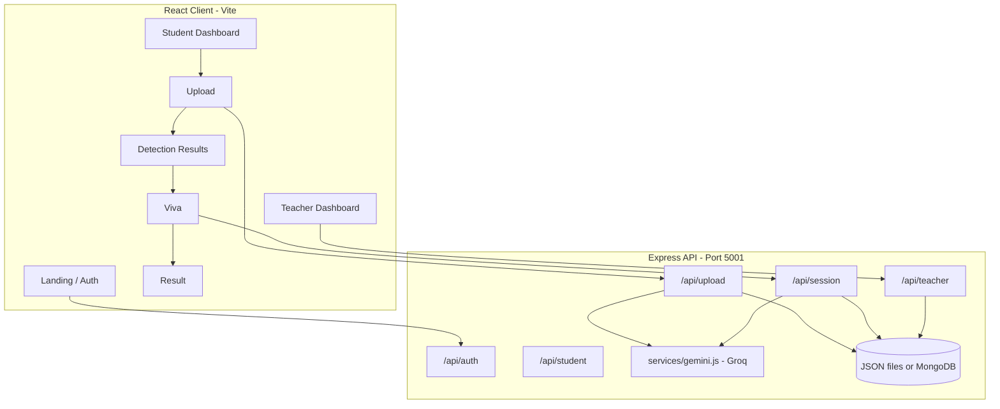

# Architecture

## Overview

**AuthentiViva** is a full-stack academic integrity platform. Students upload work, receive **live Groq AI content detection**, complete an **adaptive 5-question viva**, and get an understanding score. Teachers monitor sessions, AI risk, and student accounts.



## Core components (project spec)

| Component | Implementation |
|-----------|----------------|
| Document/code input | `server/routes/upload.js`, `server/middleware/upload.js`, `client/src/pages/Upload.jsx` |
| **AI content detection** | `server/services/gemini.js` → `detectAIContent()` (Groq, JSON mode, retries) |
| AI question generation | `server/services/gemini.js` → `generateQuestions()` |
| Adaptive viva | `server/services/gemini.js` → `generateFollowUp()`, `server/routes/session.js` |
| Understanding scoring | `server/services/gemini.js` → `evaluateSession()`, `client/src/pages/Result.jsx` |
| Student portal | `server/routes/auth.js`, `student.js`, `client/src/pages/Student*.jsx` |
| Teacher portal | `server/routes/teacher.js`, `client/src/pages/Teacher*.jsx` |

## Application flows

### 1. Student registration & login

1. `POST /api/auth/student/register` — creates student in DB (password hashed with bcrypt)
2. `POST /api/auth/student/login` — returns JWT
3. Frontend stores token; `api/client.js` attaches `Authorization: Bearer <token>`

### 2. Upload + AI detection

1. Student uploads PDF/code/text via `POST /api/upload`
2. Server extracts text (pdf-parse or UTF-8 read)
3. **Groq analyzes** full submission text → `aiDetection` object stored on submission
4. Client redirects to `/detection/:submissionId`
5. `GET /api/upload/:submissionId` returns detection (re-runs if missing on old records)

### 3. Viva session

1. `POST /api/session/start` with `submissionId` → Groq generates 5 seed questions
2. Student answers via `POST /api/session/answer` (repeat for Q2–Q5)
3. Questions 2–5 use **adaptive follow-ups** based on prior Q&A
4. After Q5, Groq **evaluates** full transcript → score stored on session
5. Client navigates to `/result/:sessionId`

### 4. Teacher oversight

- Dashboard stats, student list, session list
- **AI Risk Report** — submissions flagged by detection thresholds
- View session detail, delete students
- Login: env-based `TEACHER_USERNAME` / `TEACHER_PASSWORD` → JWT with role `teacher`

## AI layer (`server/services/gemini.js`)

| Function | Purpose | Groq required |
|----------|---------|---------------|
| `detectAIContent()` | AI vs human probability, signals, verdict | Yes |
| `generateQuestions()` | 5 viva seed questions | Yes |
| `generateFollowUp()` | Adaptive next question | Yes |
| `evaluateSession()` | Score 0–100, depth, feedback | Yes |

**No mock AI.** Missing `GROQ_API_KEY` → `503` with setup hint.

- Model: `GROQ_MODEL` (default `llama-3.3-70b-versatile`)
- Detection uses `json_mode`, temperature `0.2`, up to 3 retries
- Results tagged `analyzedBy: "Groq"` and `model` name

## Database modes

| Mode | When | Storage |
|------|------|---------|
| **Local JSON** (default) | `MONGODB_URI` empty | `server/data/*.json` via `db.js` mock classes |
| **MongoDB** | `MONGODB_URI` set | Mongoose models in `server/models/` |

Runtime data in `server/data/` is gitignored.

## Authentication

| Role | Method | Middleware |
|------|--------|------------|
| Student | JWT after register/login | `authenticate`, `optionalAuth` on upload |
| Teacher | JWT after teacher login | `authenticateTeacher` on `/api/teacher/*` |

`server/middleware/auth.js` verifies JWT with `JWT_SECRET`.

## Folder structure

```
ai-authenticity-evaluator/
├── README.md
├── .gitignore
├── docs/
│   ├── README.md              # Documentation index
│   ├── SETUP.md
│   ├── DEPENDENCIES.md
│   ├── ENV.md
│   ├── ARCHITECTURE.md
│   ├── API.md
│   └── GITHUB.md
├── client/
│   ├── src/
│   │   ├── api/client.js      # Axios + JWT interceptor
│   │   ├── context/AuthContext.jsx
│   │   ├── components/        # FileDropzone, ScoreCard, AIDetectionBadge, etc.
│   │   └── pages/
│   │       ├── LandingPage.jsx
│   │       ├── StudentLogin.jsx, StudentRegister.jsx, StudentDashboard.jsx
│   │       ├── TeacherLogin.jsx, TeacherDashboard.jsx
│   │       ├── Upload.jsx, DetectionResult.jsx
│   │       ├── Viva.jsx, Result.jsx
│   │   └── ...
│   ├── vite.config.js         # Proxy /api → localhost:5001
│   └── package.json
└── server/
    ├── .env.example
    ├── index.js
    ├── db.js
    ├── data/                  # Local DB (gitignored)
    ├── models/                # Student, Submission, Session
    ├── routes/                # auth, upload, session, teacher, student
    ├── services/gemini.js     # Groq AI (filename legacy)
    └── middleware/            # auth, upload
```

## Frontend routing (`client/src/App.jsx`)

| Path | Page | Access |
|------|------|--------|
| `/` | Landing | Public |
| `/student/login`, `/student/register` | Auth | Public |
| `/student/dashboard` | Dashboard | Student |
| `/upload` | Upload | Student |
| `/detection/:submissionId` | AI detection | Student |
| `/viva/:sessionId` | Viva | Student |
| `/result/:sessionId` | Results | Student |
| `/teacher/login` | Teacher auth | Public |
| `/teacher/dashboard` | Teacher portal | Teacher |

## Security notes

- API keys only in `server/.env` (never in client)
- Passwords hashed with bcrypt
- JWT expiry enforced server-side
- Uploaded files deleted after text extraction
- CORS limited to local dev origins
